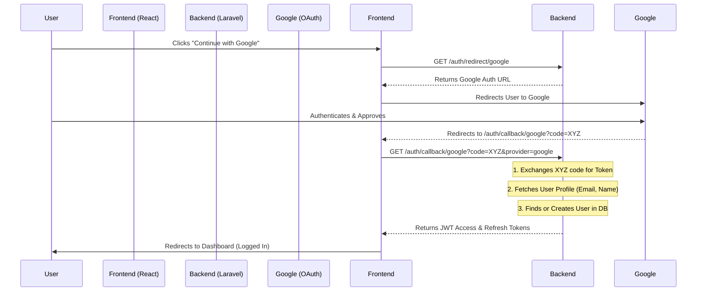

# 🔐 Social Authentication Workflow (Headless)

This document explains the secure, frictionless "Continue with Google" workflow implemented in GymOS.

## 🚀 The Frictionless SaaS Flow
We use an **Auto-Registration** strategy. If a user logs in with Google and an account doesn't exist, the system creates one automatically. This removes the "Please register first" barrier.

---

## 🗺️ Visual Workflow

---

## 🛠️ Implementation Details

### 1. Backend: `SocialAuthController.php`
- **stateless()**: Used because we don't use sessions (API based).
- **redirectUrl()**: Explicitly forced to match the Frontend URL to prevent `invalid_grant` errors in Docker/Production.
- **Provider Injection**: The frontend sends the `provider` name (google, github, etc.) allowing the backend to be generic.

### 2. Frontend: `SocialCallback.jsx`
- Acts as a "loading station."
- Extracts the `code` from the URL.
- Sends a "Handshake" request to the backend to complete the authentication.

### 3. Environment Config (`.env`)
- `GOOGLE_REDIRECT_URI`: Points to the **Frontend** callback route, NOT the backend.
- `VITE_API_BASE_URL`: Versioned API base (e.g., `/api/v1`).

---

## ⚖️ Security Protocols
- **Random Passwords**: Auto-created users get a 24-character random hash as a password placeholder.
- **Token Rotation**: On every social login, a new set of Access/Refresh tokens is issued via Sanctum.
- **Email Verification**: Socially authenticated users are marked as `email_verified_at = now()` immediately.
